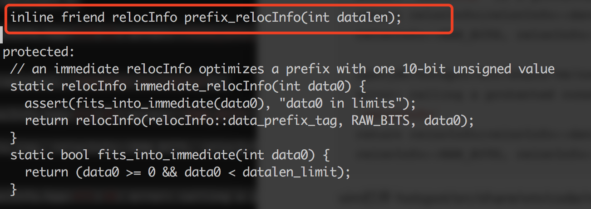
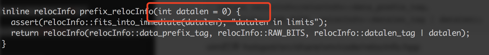
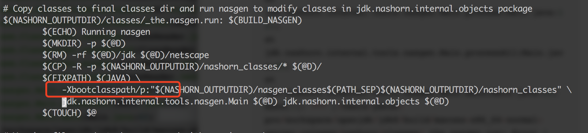
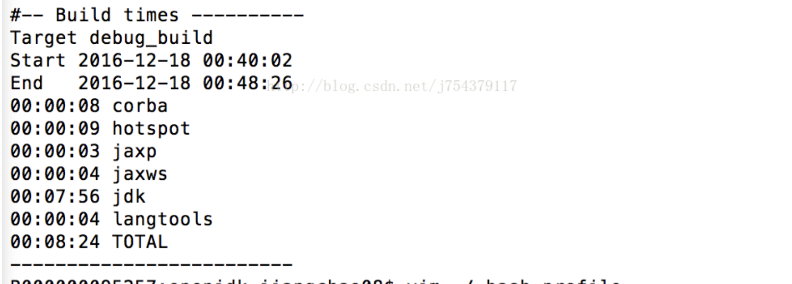
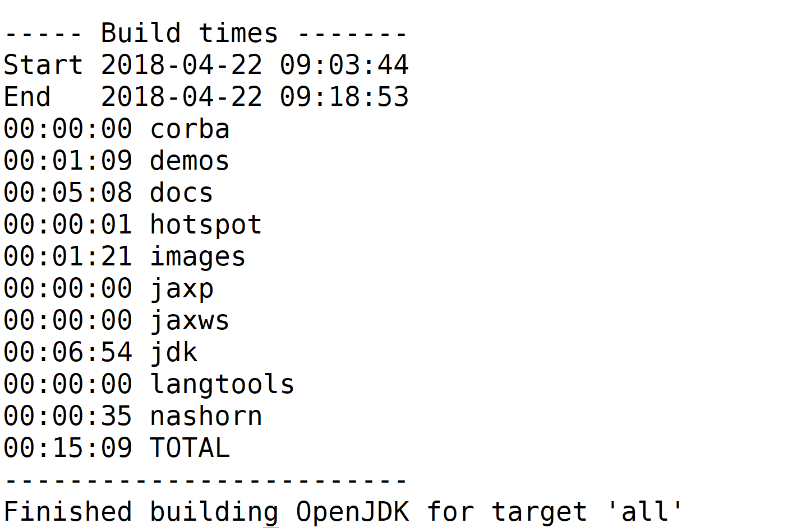

## MACOS

1. 环境准备

   1. Openjdk8使用的是[Mercurial](https://www.mercurial-scm.org/wiki/Download)作为版本控制器， 所以需要先安装Mercurial, Mac平台直接使用[homebrew](https://brew.sh/)

   > brew install mercurial 

   **homebrew现在不允许使用sudo，如果link时因没有权限失败，尝试执行以下命令：**

   > sudo chown -R $(whoami):admin /usr/local/share/man

   **如果执行失败，检查/user/local下子目录是否有执行权限，若果你不知道怎么做，可以直接执行：**

   > cd /usr/local && sudo chown -R $(whoami) bin etc include lib sbin share var Frameworks

   1. 安装XCODE

   2. 安装XQuartz: [下载地址](https://xquartz.en.softonic.com/mac)

   3. 安装llvm，安装命令:

      > brew install llvm

      **llvm-gcc和llvm-g++需要link到xcode目录下**

      > sudo ln -s /usr/bin/llvm-g++ /Applications/Xcode.app/Contents/Developer/usr/bin/llvm-g++  

      > sudo ln -s /usr/bin/llvm-gcc /Applications/Xcode.app/Contents/Developer/usr/bin/llvm-gcc 

   4. 安装freetype，同样使用homebrew:

      > brew install freetype

   5. bootjdk 推荐使用oracle jdk 7作为bootjdk进行编译 

2. 编译

   1. 通过mercurial将openjdkclone到本地目录

      ```shell
      hg clone http://hg.openjdk.java.net/jdk8/jdk8 jdk8
      cd jkd8
      bash ./get_source.sh
      ```


   2. configure

      ```shell
      cd jdk8 && bash ./configure–with-freetype-include=/usr/local/include/freetype2 –with-freetype-lib=/usr/local/lib/
      ```

      **如果出现以下错误：**

      `configure: error: GCC compiler is required`

      vim 打开 jdk8/common/autoconf/generated-configure.sh

      注释20061、21640两行代码

      `as_fn_error $? "GCC compiler is required. Try setting --with-tools-dir." "$LINENO" 5`

   3. Make 

      设定编译所需环境变量后执行make all:

      ```shell
          # 设定语言选项，必须设置
          export LANG=C
          # Mac平台，C编译器不再是GCC，是clang
          export CC=clang
          # 跳过clang的一些严格的语法检查，不然会将N多的警告作为Error
          export COMPILER_WARNINGS_FATAL=false
          # 链接时使用的参数
          export LFLAGS='-Xlinker -lstdc++'
          # 是否使用clang
          export USE_CLANG=true
          # 使用64位数据模型
          export LP64=1
          # 告诉编译平台是64位，不然会按32位来编译
          export ARCH_DATA_MODEL=64
          # 允许自动下载依赖
          export ALLOW_DOWNLOADS=true
          # 并行编译的线程数，编译时间长，为了不影响其他工作，我选择为2
          export HOTSPOT_BUILD_JOBS=2
          export ALT_PARALLEL_COMPILE_JOBS=2
          # 是否跳过与先前版本的比较
          export SKIP_COMPARE_IMAGES=true
          # 是否使用预编译头文件，加快编译速度
          export USE_PRECOMPILED_HEADER=true
          # 是否使用增量编译
          export INCREMENTAL_BUILD=true
          # 编译内容
          export BUILD_LANGTOOLS=true
          export BUILD_JAXP=true
          export BUILD_JAXWS=true
          export BUILD_CORBA=true
          export BUILD_HOTSPOT=true
          export BUILD_JDK=true
          # 编译版本
          export SKIP_DEBUG_BUILD=true
          export SKIP_FASTDEBUG_BUILD=false
          export DEBUG_NAME=debug
          # 避开javaws和浏览器Java插件之类的部分的build
          export BUILD_DEPLOY=false
          export BUILD_INSTALL=false
      ```

      你也可以直接将这些参数跟在make命令之后, 例如(部分参数)：

      ```shell
      make all COMPILER_WARNINGS_FATAL=false LFLAGS='-Xlinker -lstdc++' CC=clang USE_CLANG=true LP64=1
      ```

      如果出现报错:

      ```shell
      openjdk/hotspot/src/share/vm/code/relocInfo.hpp:374:27: error: friend declaration specifying a default argument must
            be a definition
      inline friend relocInfo prefix_relocInfo(int datalen = 0);

      openjdk/hotspot/src/share/vm/code/relocInfo.hpp:469:18: error: friend declaration specifying a default argument must
            be the only declaration
      inline relocInfo prefix_relocInfo(int datalen) {

      openjdk/hotspot/src/share/vm/code/relocInfo.hpp:470:21: error: 'fits_into_immediate' is a protected member of 'reloc
           Info'
      assert(relocInfo::fits_into_immediate(datalen), "datalen in limits");

      openjdk/hotspot/src/share/vm/code/relocInfo.hpp:471:59: error: 'RAW_BITS' is a protected member of 'relocInfo'
      return relocInfo(relocInfo::data_prefix_tag, relocInfo::RAW_BITS, relocInfo::datalen_tag | datalen);

      openjdk/hotspot/src/share/vm/code/relocInfo.hpp:471:10: error: calling a protected constructor of class 'relocInfo'
      return relocInfo(relocInfo::data_prefix_tag, relocInfo::RAW_BITS, relocInfo::datalen_tag | datalen);
      ```

      vim打开 hotspot/src/share/vm/code/relocInfo.hpp

      修改367行为：

      

      修改462行为：

      

      如果继续出现错误：

      ```java
      Running nasgen
      Exception in thread "main" java.lang.VerifyError: class jdk.nashorn.internal.objects.ScriptFunctionImpl overrides final method setPrototype.(Ljava/lang/Object;)V
      at java.lang.ClassLoader.defineClass1(Native Method)
      at java.lang.ClassLoader.defineClass(ClassLoader.java:763)
      at java.security.SecureClassLoader.defineClass(SecureClassLoader.java:142)
      at java.net.URLClassLoader.defineClass(URLClassLoader.java:467)
      at java.net.URLClassLoader.access$100(URLClassLoader.java:73)
      at java.net.URLClassLoader$1.run(URLClassLoader.java:368)
      at java.net.URLClassLoader$1.run(URLClassLoader.java:362)
      at java.security.AccessController.doPrivileged(Native Method)
      at java.net.URLClassLoader.findClass(URLClassLoader.java:361)
      at java.lang.ClassLoader.loadClass(ClassLoader.java:424)
      at sun.misc.Launcher$AppClassLoader.loadClass(Launcher.java:331)
      at java.lang.ClassLoader.loadClass(ClassLoader.java:357)
      at jdk.nashorn.internal.tools.nasgen.StringConstants.<clinit>(StringConstants.java:85)
      at jdk.nashorn.internal.tools.nasgen.ScriptClassInstrumentor$2.visitMethodInsn(ScriptClassInstrumentor.java:157)
      at jdk.internal.org.objectweb.asm.MethodVisitor.visitMethodInsn(MethodVisitor.java:509)
      at jdk.internal.org.objectweb.asm.ClassReader.readCode(ClassReader.java:1445)
      at jdk.internal.org.objectweb.asm.ClassReader.readMethod(ClassReader.java:1046)
      at jdk.internal.org.objectweb.asm.ClassReader.accept(ClassReader.java:722)
      at jdk.internal.org.objectweb.asm.ClassReader.accept(ClassReader.java:535)
      at jdk.nashorn.internal.tools.nasgen.Main.process(Main.java:121)
      at jdk.nashorn.internal.tools.nasgen.Main.processAll(Main.java:88)
      at jdk.nashorn.internal.tools.nasgen.Main.main(Main.java:62)
      make[1]: *** [/Users/ydcun-pro/workspace/openjdk/jdk8/build/macosx-x86_64-normal-server-release/nashorn/classes/_the.nasgen.run] Error 1
      make: *** [nashorn-only] Error 2
      ```

      修改 vim nashorn/make/BuildNashorn, 80行原先-cp修改为：

      

      **大工告成，你会看到以下信息！**

      


## LINUX(centos)
1. 环境准备

   1. *同样需要先安装mercurial*

        新建文件/etc/yum.repos.d/mercurial.selenic.com.repo， 之后直接运行：

        >yum install mercurial 
      
   2. *bootjdk*

        需要准备一个6u14以上的jdk，因为OpenJdk的各个组成部分有的是使用c++编写的，但更多的代码则是使用java自身实现的，因此编译这部分java代码需要一个可用的jdk，官方称之为“BootStrap JDK”
      
      
   3. 编译工具类库

        GUN MAKE 3.81或更高的版本

        > yum groupinstall "Development Tools"
            
        > yum install libXtst-devel libXt-devel libXrender-devel
            
        > yum install cups-devel
            
        > yum install freetype-devel
            
        > yum install alsa-lib-devel
            
        > yum install ccache

   4. 其它依赖 

        >zip, unzip.

2. 源码迁出

       ```shell
       hg clone http://hg.openjdk.java.net/jdk8/jdk8 jdk8
       cd jkd8
       bash ./get_source.sh
       ```
3. 编译

     执行 bash ./configure
     设定环境变量：
      ```shell
      # 设定语言选项，必须设置
      export LANG=C
      #允许自动下载依赖
      export ALLOW_DOWNLOADS=true
      # 跳过clang的一些严格的语法检查，不然会将N多的警告作为Error
      export COMPILER_WARNINGS_FATAL=false
      # 使用64位数据模型
      export LP64=1
      # 告诉编译平台是64位，不然会按32位来编译
      export ARCH_DATA_MODEL=64
      # 允许自动下载依赖
      export ALLOW_DOWNLOADS=true
      # 并行编译的线程数，编译时间长，为了不影响其他工作，我选择为2
      export HOTSPOT_BUILD_JOBS=2
      export ALT_PARALLEL_COMPILE_JOBS=2
      # 是否跳过与先前版本的比较
      export SKIP_COMPARE_IMAGES=true
      # 是否使用预编译头文件，加快编译速度
      export USE_PRECOMPILED_HEADER=true
      # 是否使用增量编译
      export INCREMENTAL_BUILD=true
      # 编译内容
      export BUILD_LANGTOOLS=true
      export BUILD_JAXP=true
      export BUILD_JAXWS=true
      export BUILD_CORBA=true
      export BUILD_HOTSPOT=true
      export BUILD_JDK=true
      # 编译版本
      export SKIP_DEBUG_BUILD=true
      export SKIP_FASTDEBUG_BUILD=false
      export DEBUG_NAME=debug
      # 避开javaws和浏览器Java插件之类的部分的build
      export BUILD_DEPLOY=false
      export BUILD_INSTALL=false
      
      #如果设置了java环境变量 必须去掉
      unset CLASSPATH
      unset JAVA_HOME
   ```
   执行MAKE ALL

   

   ​

   大功告成！