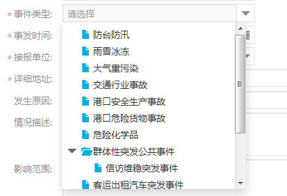
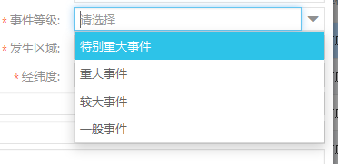
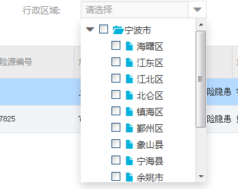
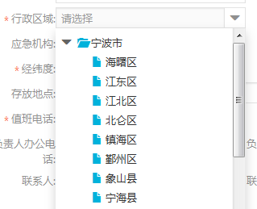

# 全局user对象新增属性说明
1. user.bindOrg
 -  说明：为当前用户绑定的机构信息，供应急报送和应急保障需要的部分功能使用，需要判断是否存在
 -  示例       

        `if(!user.bindOrg){
            fish.info("用户尚未加入机构,请先加入");
            return;
        }else{
            balabala...
        }`
2. user.emgcStaff.bindEmcOrg
  - 说明：为当前用户绑定的应急机构，供应急报送部分功能使用，需要判断是否存在
  - 示例      
  
        `if(!user.emgcStaff.bindEmcOrg){
            fish.info("用户尚未加入应急机构,请先加入");
            return;
        }else{
           balabala... 
        }`
            

# 下拉系列
## 应急机构
1. 说明:根据当前登录用户id，获取用户角色；再通过关联BFM_ROLE_DATAFILTER获取组织机构规则，依此规则查询BFM_ORG和TC_EMC_ORG，获取此用户可访问的应急机构集。
2. 接口:'EmgcController/qryEmgcStaff.json'。用户登陆后，挂载在全局的user.emgcStaff.tcEmcOrgs里(路径：/tedp-web/src/main/webapp/AppView.js)
3. 封装的初始化应急机构下拉树方法:(路径：modules/drc/resrepository/common/ResizeUtil.js) 
   - ResizeUtil.initEmcOrgTreeNoCheck(id) ← 这个id是控件的，参考初始化字典表 initSelect的写法
        
   - ResizeUtil.initEmcOrgTree(id)  ← 这个id是控件的，参考初始化字典表 initSelect的写法
        

## 事件类型
1. 说明:根据用户能访问的应急机构，获取可访问事件类型数据权限（TC_EMC_ORG_EVENT_TYPE、TC_EVENT_TYPE关联获取可访问事件类型集）
2. 接口:'EmgcController/qryEmgcStaff.json'。用户登陆后，挂载在全局的user.emgcStaff.tcEventTypes里(路径：/tedp-web/src/main/webapp/AppView.js)
3. 封装的初始化下拉树的方法
  - initEmcEvtTypeNoCheck
  - 
  - initEmcEvtType(id)
  - 

## 事件等级
1. initEmcEvtLevel(dom) ← 参考初始化字典表 initSelect的写法
2. 

## 事件来源
1. initEmcEvtSource(dom)

## 行政区划，数据来源于BFM_AREA里 IS_PROJECT_AREA 为'A'的
1. 多选
 - initEmcArea(dom) ← 参考初始化字典表 initSelect的写法
 - 
 
2. 单选
 - initEmcAreaNoCheck(dom) ← 参考初始化字典表 initSelect的写法
 - 

## 专题报送的应急分类
1. initEmcTheme4Report(dom) ← 参考初始化字典表 initSelect的写法
2. 

## 专题报送的应急分类（详情 单选）
1. initEmcTheme4ReportNoCheck(dom) ← 参考初始化字典表 initSelect的写法
2. 
 
## 自定义的下拉树
1. 单选  initEmcEvtCombotreeCommonNoCheck(dom,listValue)
2. 多选  initEmcEvtCombotreeCommon(dom,listValue)