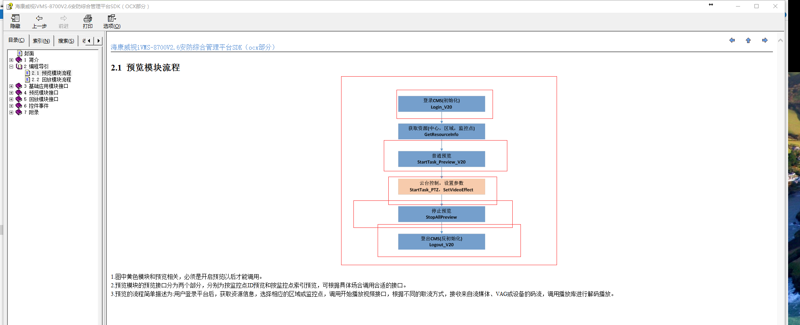
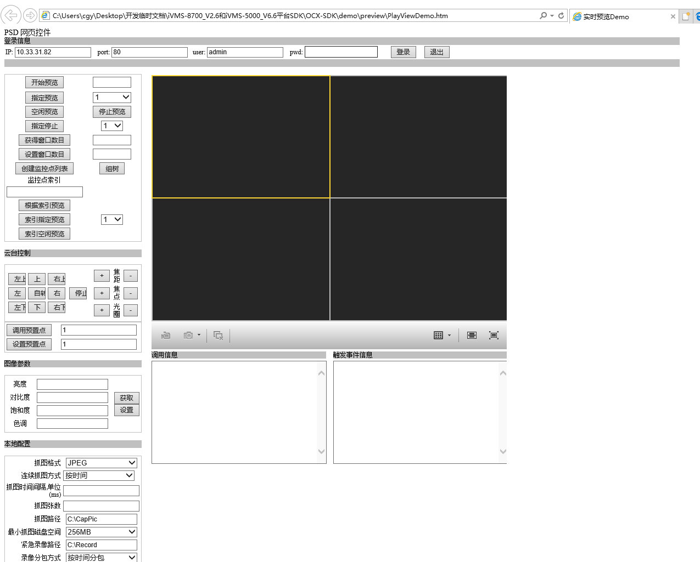
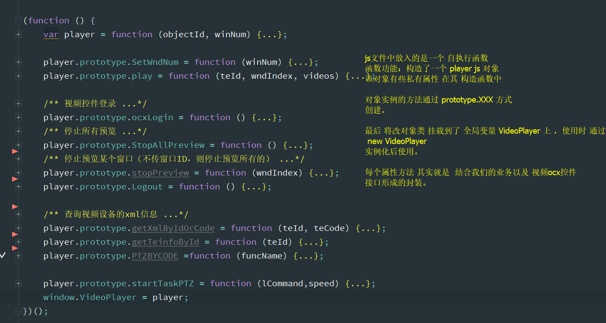

# web端视频控件ocx js 封装常规方式
  以宁波项目中使用的海康视频控件为列！
  
> ## 开发前准备
     ocx 控件安装文件 ocx 控件demo 以及 相关api 文档，好的控件demo 中基本上很多代码你都可以 ctrl + c /v 
     海康控件svn：http://10.45.7.208/svnzqzhjt/design/03 Solution解决方案/sts_nbjt宁波智慧交通一期/04 参考资料/海康视频控件
     
  ## 根据api文档熟悉基本的控件加载
     
     
  ## 到demo中寻找控件的初始化过程 一般是 object 标签， 必要信息有 classid id 列如下面代码片段：
     
       //html 中 id 以及  classid 很重要 classid 是 ocx 控件 初始化到页面的识别符。 id 是 js 调用 ocx控件接口的入口标识
       <object classid="clsid:AC036352-03EB-4399-9DD0-602AB1D8B6B9" id="PreviewOcx"  width="650px" height="500" name="ocx" >
       
       //视频控件接口的调用代码 示列 demo 中 实时播放方法
       /*****实时预览******/
        function StartPlayView()
           {
               var OCXobj = document.getElementById("PreviewOcx");
       		CameraID = document.getElementById("TextCameraId").value;
       		if(!(parseInt(CameraID)>=1 && parseInt(CameraID)<=2147483647)){
       		showMethodInvokedInfo("CameraID介于1到2147483647之间！");
       		return;
       	}
       		//if(""==CameraID){
       		//	alert("请选择一个监控点！");
       		//	return;
       		//}
       		if (CameraID.length == 0 || isNaN(CameraID) || ""==CameraID) {
       		showMethodInvokedInfo("请选择监控点，且监控点必须是一个整数！");
       		//alert("必须是一个整数.");
       		return ;
       }
       		var ret = OCXobj.StartTask_Preview(CameraID);
                       //var ret1 = OCXobj.StartFreeWndByIndexCode("076a48e02668446d90ecfe54c1cab3af");
       		switch(ret){
       		case 0:
       			showMethodInvokedInfo("StartTask_Preview接口调用成功！");
       			break;
       		case -1:
       			showMethodInvokedInfo("StartTask_Preview接口调用失败！错误码："+ OCXobj.GetLastError());
       			break;
       		default:
       			break;
       		}
         }
         
  ## 到了这里基本就知道 ocx 控件到底怎么用了
     剩下的就是 按部就班（接口文档 结合demo） 把相关功能集成到 我们自己 HikVideoPlay.js 类似这样的视频js中
     
     代码详细 可在 webfront 项目中 查找到 VideoPlayer.js
         
         
         
       
     